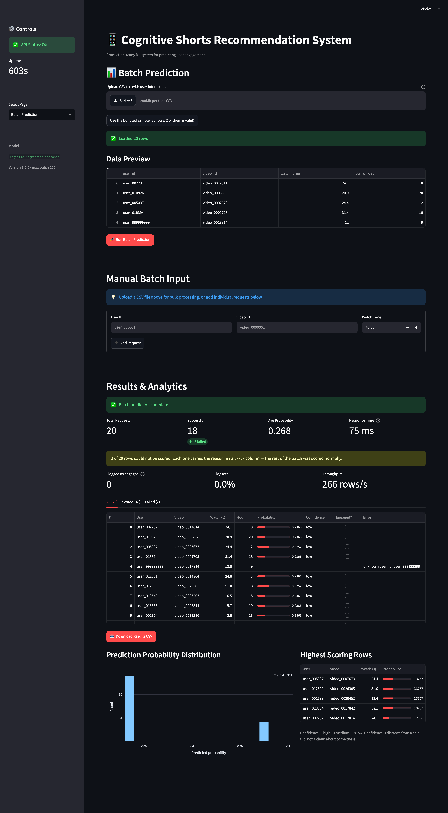

# Batch Prediction

[](https://github.com/PSCRedefine/BatchPrediction/actions/workflows/tests.yml)

Batch engagement prediction for **Cognitive Shorts**: a FastAPI service that
scores up to 100 user-video interactions per call, and a Streamlit console for
driving it from a CSV or by hand.

Built to [docs/SPEC.md](docs/SPEC.md). 78 tests.

*Two of four in [a series](#the-series):*  [Single Prediction](https://github.com/PSCRedefine/SinglePrediction) → **Batch Prediction** → [Model Info](https://github.com/PSCRedefine/ModelInfo) → [Analytics Dashboard](https://github.com/PSCRedefine/AnalyticsDashboard)



---

## Contents

- [What it does](#what-it-does)
- [Quick start](#quick-start)
- [How a batch is processed](#how-a-batch-is-processed)
- [Fault tolerance](#fault-tolerance)
- [The model](#the-model)
- [Deployment](#deployment)
- [Repository layout](#repository-layout)
- [Verification](#verification)
- [Limitations](#limitations)
- [The series](#the-series)

---

## What it does

```text
CSV upload  ─┐
             ├─→ app.py ──POST /predict/batch──→ api.py ──→ FeatureStore ──→ model
manual entry ─┘   (Streamlit)                    (FastAPI)   users.csv        │
                                                             videos.csv       │
                      ┌──────────────────────────────────────────────────────┘
                      ▼
        metrics · results table · CSV download · probability histogram
```

The page holds no model and no data. Everything it shows came back over HTTP,
so what you see is exactly what any API client would get.

## Quick start

With Docker:

```bash
docker compose up --build
```

Or locally:

```bash
python -m pip install -r requirements-dev.txt
python -m pip install -e .
```

Start the API:

```bash
uvicorn batch_prediction.api:app --reload
```

Start the console in a second terminal:

```bash
streamlit run app.py
```

Then open http://localhost:8501 and upload
[`data/sample_batch_requests.csv`](data/sample_batch_requests.csv) — 20 rows,
two of which fail on purpose so the error path is visible on the first run.
Or skip the file picker: **http://localhost:8501/?demo=1** loads that sample and
scores it in one step. The screenshot above is that URL, captured unedited.

Point the console at a different API with `BATCH_PREDICTION_API_URL`.

## How a batch is processed

1. **Validate columns.** `user_id`, `video_id` and `watch_time` are required;
   a missing one stops the upload with `Missing required columns: [...]`.
   `hour_of_day` is optional.
2. **Truncate to 100.** The service caps a batch at 100, so the page sends 100
   rather than sending 500 and getting a 400 back. Over-length files get a
   warning naming the real row count.
3. **Convert types.** Identifiers to string, `watch_time` to float,
   `hour_of_day` to a nullable integer. A value that will not convert becomes
   null rather than raising — a batch reports bad rows, it does not refuse the
   file.
4. **Build features.** Each row is resolved against the user and video tables,
   and `watch_ratio` is computed from `watch_time` and the video's duration.
5. **Score once.** Every row that survived step 4 is scored in a single call,
   not one call per row.
6. **Reassemble.** Results come back in submission order, each carrying the
   `index` it had in the request.

## Fault tolerance

The batch route's central property: **one bad row costs you that row, not the
batch.** Fault isolation happens during feature construction, which is where
the failures actually are — an identifier that does not resolve, a watch time
that is not a number. Those rows get an `error` string and null predictions;
everything else is scored normally, and `successful` counts only the scored
rows.

Running the shipped sample:

```text
batch_size=20 successful=18 failed=2 response_time_ms=29.6
index  user_id          video_id         probability  error
    3  user_018394      video_0009705       0.236613  None
    4  user_999999999   video_0017814            NaN  unknown user_id: user_999999999
    5  user_012831      video_0014304       0.236613  None
   11  user_000001      video_999999999          NaN  unknown video_id: video_999999999
```

A failure that is *not* one row's fault — the model itself raising — returns
500 for the whole batch instead, because attributing it to a row would be a
lie.

## The model

`models/best_model.joblib` is committed (3 KB) so the repository runs after a
clone with no training step. It is an isotonic-calibrated logistic regression
over two features, `watch_time_seconds` and `watch_ratio`, trained in the
[SinglePrediction](https://github.com/PSCRedefine/SinglePrediction) project.

**Why this model, and what it was chosen over:
[docs/MODEL_SELECTION.md](docs/MODEL_SELECTION.md)** — four candidates, a paired
bootstrap showing all four are statistically tied, the cost argument that breaks
the tie, the calibration trade-off it costs, and why the threshold is 0.381.

Two things are worth knowing before reading anything into its output:

- **The signal is weak.** Test ROC-AUC is 0.5796. The lift at the recommended
  operating point is 1.40x — real, but modest.
- **The decision threshold is 0.381, not 0.5.** The model's maximum output on
  this data is 0.389, so at 0.5 it flags nothing at all. The threshold ships in
  `model_metadata.json` and the service reads it from there.

Isotonic calibration is a step function, so probabilities repeat across rows.
That is the calibrator, not a bug.

`hour_of_day` is part of the API contract because the specification defines it
as an input. It is not a model feature. Accepting a field and training on it
are separate decisions.

## Deployment

Two services from one image: the API on 8000, the console on 8501. The console
waits for the API's health check before it starts, and that check tests
`model_loaded` rather than just the port — a degraded service answers on the
port perfectly well.

```bash
docker compose up --build
```

Full guide, including configuration, probes, scaling and troubleshooting:
**[docs/DEPLOYMENT.md](docs/DEPLOYMENT.md)**. The local path there was run end
to end; the Docker build was not, because Docker is not installed on the
development machine.

## Repository layout

```text
app.py                           Streamlit console
src/batch_prediction/
  api.py                         FastAPI: /predict/batch, /predict, /health, /model/info
  batching.py                    upload validation, type conversion, payload building
  features.py                    identifier resolution, watch_ratio, per-row isolation
  config.py                      paths, batch limit, confidence bands
models/                          committed model and metadata (3 KB)
data/
  users.csv, videos.csv          lookup tables the FeatureStore needs
  sample_batch_requests.csv      20 rows, two failing on purpose
Dockerfile, docker-compose.yml   one image, two services
docs/
  SPEC.md                        the requirements this was built to
  MODEL_SELECTION.md             why this model, with the measurements
  DEPLOYMENT.md                  running it, locally and in containers
  API.md                         endpoint contract
  PRODUCTION_READINESS.md        what it would need to carry real traffic
image/                           console screenshots
tests/                           78 tests
```

## Verification

```bash
python -m pytest -q
```

| Area | Tests | Covers |
|---|---:|---|
| `test_api.py` | 29 | routes, status codes, per-row errors, batch limits, clipping |
| `test_features.py` | 25 | identifier validation, `watch_ratio`, per-row isolation |
| `test_batching.py` | 24 | required columns, truncation, type conversion, payload shape |

The API tests run against the real shipped model and the real lookup tables. A
stubbed store would not exercise identifier resolution, which is where most
per-row errors come from.

## Limitations

This section lists what is known to be missing or imperfect in what was built.
A wider account — what this service would need before it carries real traffic,
ordered by risk, with the cost of each remedy — is in
[docs/PRODUCTION_READINESS.md](docs/PRODUCTION_READINESS.md).

- **This duplicates SinglePrediction's model and feature code.** The two
  repositories now hold separate copies of `features.py`, the API skeleton and
  the model artifact; a change to the feature contract has to be made twice.
  Keeping batch prediction as a page in that project would have avoided it.
- **No training here.** The model is inherited. Retraining happens in
  SinglePrediction, and the artifact is copied across.
- **The 100-row cap is a constant**, not a function of load. It protects the
  service from one caller, not from many.
- **`users.csv` and `videos.csv` are committed** (9 MB) so a clone runs. A real
  deployment would read them from a store rather than from the repository.

---

## The series

Four repositories, read in this order, are one product line: score one, score
many, check what is deployed, then watch it in production.

1. [Single Prediction](https://github.com/PSCRedefine/SinglePrediction) — one prediction per request — feature selection, model choice, calibration and the operating point
2. **Batch Prediction** *(you are here)* — up to 100 rows per call, with per-row fault isolation
3. [Model Info](https://github.com/PSCRedefine/ModelInfo) — what is actually loaded in memory, and what that tells you
4. [Analytics Dashboard](https://github.com/PSCRedefine/AnalyticsDashboard) — traffic and model-output monitoring over a request log

Each repository runs on its own. The cost of that is stated plainly in each
Limitations section: `features.py`, the API skeleton and the model artefact
are duplicated across all four.
